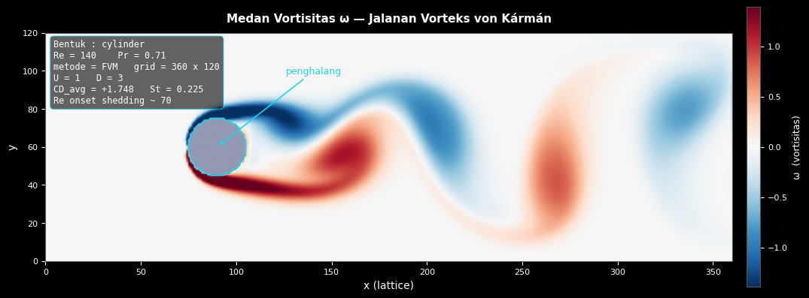
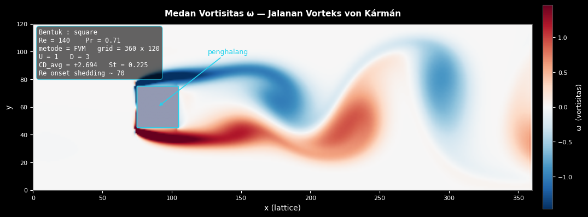
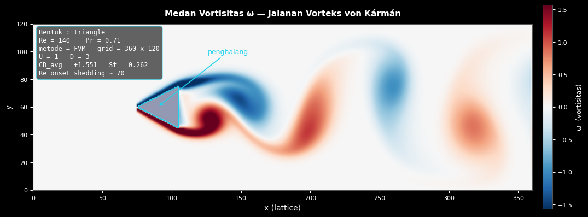
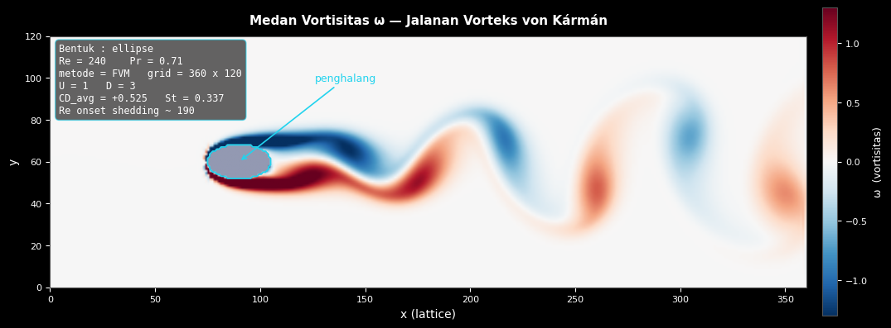
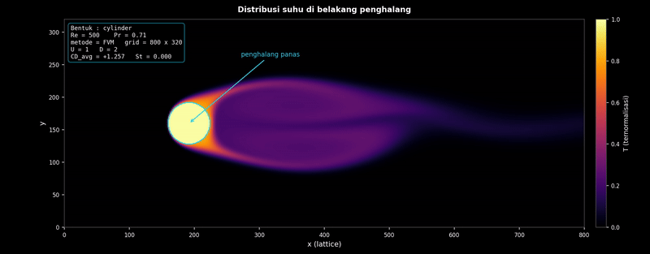
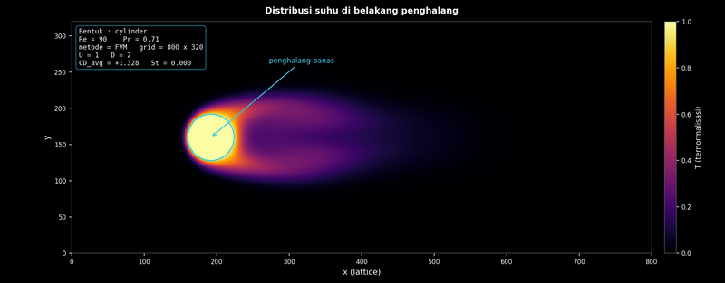

# Group 17

[](https://opensource.org/licenses/MIT)
[](https://www.python.org/downloads/)
[](#)

| Name | Student ID (NPM) |
|:--|:--|
| Sandy Fauzi A | 140310240054 |
| Anisa Nurhasanah | 140310240001 |
| Choirinnisa Ayu K | 140310240003 |
| Siti Novianti | 140310240002 |

[Bahasa Indonesia](README.md) | [English](README.en.md)

## Visual Demonstration

### Vorticity Characteristics across 4 Mandatory Geometries





### Video Simulation (Temperature & Velocity)

**1. Cylinder Temperature (Re=500)**


**2. Cylinder Temperature (Re=90)**


## 2D Vortex Shedding and Heat Distribution Simulation

A two-dimensional Navier-Stokes solver for incompressible flow past an obstacle in a channel. The program solves the momentum and continuity equations coupled with an energy (temperature) equation, then shows the vortex shedding pattern (von Karman vortex street) and the spread of heat behind the obstacle.

The simulation runs as a desktop application. You set parameters in the left panel, start the run, and watch the flow field render live. Two discretization methods (FDM and FVM) and two compute backends (CPU and GPU) can be selected and compared on the same case.

## Features

| Feature | Description |
|:--|:--|
| Two methods | FDM (central difference) and FVM (blended central/upwind), selectable in the GUI |
| Two backends | CPU (Numba) and GPU (CuPy), selectable at runtime |
| Obstacle geometry | cylinder, ellipse, square, diamond, hexagon, triangle, plate; size and orientation angle adjustable |
| Display fields | vorticity, temperature, and velocity magnitude |
| Colormaps | several colormaps that can be switched while the simulation runs |
| Interface theme | dark and light mode |
| Physics metrics | drag (CD) and lift (CL) coefficients, Strouhal number, Nusselt number, velocity divergence, Poisson residual, steps per second |
| Speed control | throttles the simulation rate, from slow motion to full speed |
| Export | PNG snapshot (with a parameter legend) and MP4 animation |

## Compute backend

The backend is chosen per simulation through the "Compute Backend" panel in the GUI. The solver code is the same for both; only the array library differs.

| Mode | Engine | Module |
|:--|:--|:--|
| CPU | Numba `@njit(parallel=True)`, using all cores | `src/kernels.py` |
| GPU | CuPy (array operations and a RawKernel for Poisson) | `src/gpu_ops.py` |

CuPy supports NVIDIA GPUs only, not Intel or AMD integrated graphics. If no NVIDIA GPU is detected, the GPU option is disabled and the program runs on CPU.

You can force the default backend with an environment variable:

```bash
FISKOM_BACKEND=cpu python main.py
FISKOM_BACKEND=gpu python main.py
```

## Performance note

The GPU is not always faster than the CPU. On small grids the whole working set fits in the L3 cache, so the multicore CPU (Numba) wins. The GPU pulls ahead only on large grids, once kernel launch overhead is amortized and the data spills from cache to RAM. On the GTX 1650 Ti laptop used for testing, the crossover sits near 800x320 cells: above that size the GPU is faster (up to about 2x at 1400x560), below it the CPU is faster.

To measure on your own machine:

```bash
python tests/benchmark.py
```

## Project structure

```text
NavierStokes-2D/
├── README.md                  # documentation (Bahasa Indonesia)
├── README.en.md               # documentation (English)
├── requirements.txt           # Python dependencies
├── main.py                # entry point: opens the GUI application
├── src/                       # core program code
│   ├── config.py              # simulation and physics parameters
│   ├── backend.py             # CPU/GPU backend detection and selection
│   ├── grid.py                # field allocation and obstacle geometry
│   ├── kernels.py             # CPU engine (Numba JIT)
│   ├── gpu_ops.py             # GPU engine (CuPy)
│   ├── solver.py              # time stepping (Chorin projection), CD/CL/Strouhal/Nusselt
│   ├── render.py              # image and video renderer (matplotlib)
│   └── gui.py                 # desktop interface (PyQt6 + PyVista)
├── tests/                 # physics and performance validation scripts
│   ├── benchmark.py           # throughput and FPS, CPU vs GPU
│   ├── validate_poiseuille.py # check against the analytic Poiseuille solution
│   ├── test_conservation.py      # mass conservation and temperature positivity
│   ├── test_convergence.py     # grid convergence (order of accuracy)
│   └── test_stability.py      # Courant and Fourier numbers
└── utils/                  # output production tools
    ├── batch_plot.py          # automatic PNG export for several geometries
    └── render_mp4.py          # render an MP4 animation from the command line
```

All output (PNG, MP4) is saved to the `results/` folder inside this directory.

## Requirements

- Python 3.10 or newer
- An NVIDIA GPU is optional; without one the program runs on CPU

Install dependencies:

```bash
pip install -r requirements.txt
```

For GPU acceleration, install CuPy matching your CUDA version:

```bash
pip install cupy-cuda12x      # for CUDA 12.x
```

## Running

The GUI application (main):

```bash
python main.py
```

A desktop window opens. Set the geometry, Reynolds number, grid resolution, method, and backend in the left panel, then press Start.

Render an MP4 animation from the command line:

```bash
python utils/render_mp4.py --field temperature --re 150
```

Export a set of PNG images for several geometries:

```bash
python utils/batch_plot.py
```

Run a test (stability example):

```bash
python tests/test_stability.py
```

## Background

### Governing equations

Incompressible flow with passive heat transport is governed by:

$$\nabla \cdot \mathbf{u} = 0$$

$$\frac{\partial \mathbf{u}}{\partial t} + (\mathbf{u} \cdot \nabla)\mathbf{u} = -\frac{1}{\rho}\nabla p + \nu \nabla^2 \mathbf{u}$$

$$\frac{\partial T}{\partial t} + (\mathbf{u} \cdot \nabla)T = \alpha \nabla^2 T$$

where $\mathbf{u}$ is velocity, $p$ pressure, $T$ temperature, $\nu$ kinematic viscosity, and $\alpha$ thermal diffusivity. The Reynolds number is $Re = U D / \nu$, with $D$ the characteristic size of the obstacle.

### Chorin projection method

Each time step uses a fractional-step method on a staggered (MAC) grid:

1. Predict a tentative velocity $\mathbf{u}^{\ast}$ from the advection and diffusion terms, ignoring pressure.
2. Solve the pressure Poisson equation so the final velocity is divergence free.
3. Correct $\mathbf{u}^{\ast}$ with the pressure gradient to get $\mathbf{u}^{n+1}$.
4. Update the temperature field by advection and diffusion using $\mathbf{u}^{n+1}$.

### Full discrete form

Each derivative is approximated by finite differences on a uniform grid (spacing $\Delta x$, $\Delta y$, time step $\Delta t$). Index $i$ runs along $x$ and $j$ along $y$.

Continuity (the final velocity is divergence free):

$$\frac{u_{i+1,j} - u_{i-1,j}}{2\Delta x} + \frac{v_{i,j+1} - v_{i,j-1}}{2\Delta y} = 0$$

Momentum, velocity prediction ($u$ component; the $v$ component is analogous):

$$u_{i,j}^{\ast} = u_{i,j}^n + \Delta t \left[ -\left( u \frac{u_{i+1,j} - u_{i-1,j}}{2\Delta x} + v \frac{u_{i,j+1} - u_{i,j-1}}{2\Delta y} \right) + \nu \left( \frac{u_{i+1,j} - 2u_{i,j} + u_{i-1,j}}{\Delta x^2} + \frac{u_{i,j+1} - 2u_{i,j} + u_{i,j-1}}{\Delta y^2} \right) \right]$$

Pressure Poisson:

$$\frac{p_{i+1,j} - 2p_{i,j} + p_{i-1,j}}{\Delta x^2} + \frac{p_{i,j+1} - 2p_{i,j} + p_{i,j-1}}{\Delta y^2} = \frac{\rho}{\Delta t}\left( \frac{u_{i+1,j}^{\ast} - u_{i-1,j}^{\ast}}{2\Delta x} + \frac{v_{i,j+1}^{\ast} - v_{i,j-1}^{\ast}}{2\Delta y} \right)$$

Velocity correction:

$$u_{i,j}^{n+1} = u_{i,j}^{\ast} - \frac{\Delta t}{\rho}\frac{p_{i+1,j} - p_{i-1,j}}{2\Delta x}$$

Energy (temperature transport, using $u^{n+1}$ and $v^{n+1}$):

$$T_{i,j}^{n+1} = T_{i,j}^n + \Delta t \left[ -\left( u \frac{T_{i+1,j} - T_{i-1,j}}{2\Delta x} + v \frac{T_{i,j+1} - T_{i,j-1}}{2\Delta y} \right) + \alpha \left( \frac{T_{i+1,j} - 2T_{i,j} + T_{i-1,j}}{\Delta x^2} + \frac{T_{i,j+1} - 2T_{i,j} + T_{i,j-1}}{\Delta y^2} \right) \right]$$

### Numerical stability

The explicit scheme must satisfy the conditions below to stay stable. The program computes all three, takes the strictest, and reduces $\Delta t$ automatically.

$$\text{CFL: } \quad U \frac{\Delta t}{\Delta x} \le 1$$

$$\text{Viscous diffusion (Fourier): } \quad \nu \frac{\Delta t}{\Delta x^2} \le 0.5$$

$$\text{Thermal diffusion: } \quad \alpha \frac{\Delta t}{\Delta x^2} \le 0.5$$

### Numerical choices

| Component | Approach |
|:--|:--|
| Grid | staggered / MAC |
| Time integration | explicit Euler with Chorin projection |
| Advection (FDM) | second-order central difference |
| Advection (FVM) | blended central and upwind (`adv_blend`, deferred correction) |
| Diffusion | second-order Laplacian |
| Pressure | iterative Poisson solver (Jacobi) |
| Walls | `freeslip` (default) or `noslip` |

FVM blends the central scheme (low numerical diffusion) with a small amount of upwind (stable). The `adv_blend` parameter (default 0.8) keeps the flow stable without making it too diffusive, so the von Karman vortex street can form.

### FDM compared with FVM

| Aspect | FDM | FVM |
|:--|:--|:--|
| Basis | derivative approximation at points | flux balance across cell faces |
| Local conservation | not guaranteed | guaranteed |
| Advection | second-order central | blended central/upwind |
| Stability | prone to divergence at high cell Reynolds | more stable due to the upwind portion |

## Testing and validation

Scripts in the `tests/` folder:

- `validate_poiseuille.py` compares the numerical velocity profile against the analytic Poiseuille channel solution.
- `test_conservation.py` checks velocity divergence (mass conservation) and temperature bounds (maximum principle).
- `test_convergence.py` measures error against grid resolution to estimate the order of accuracy.
- `test_stability.py` reports the Courant and Fourier numbers and tracks divergence over time.
- `benchmark.py` measures throughput (steps per second, MLUPS) for CPU and GPU across several grid sizes.

### Test Results

Sample output from numerical stability test and CPU vs GPU benchmark:

```text
================================================================
  UJI STABILITAS NUMERIK : Navier-Stokes 2D
================================================================
  [Re=150 (default GUI)]  dt = 0.01667
    Courant (CFL adveksi) = 0.2000   [OK, batas < 1]
    Difusi (von Neumann)  = 0.0320   [OK, batas < 0.5]
    Difusi termal         = 0.0451   [OK, batas < 0.5]
    -> 3000 langkah: max|div u| = 2.42e+00, finite = True  ==>  STABIL

================================================================
  UJI KONSERVASI MASSA & POSITIVITAS SUHU
================================================================
Menjalankan simulasi FVM...
  FVM - Max Divergence: 8.50e+00
  FVM - Suhu Terendah : -0.0023 (Seharusnya >= 0.0)
  FVM - Suhu Tertinggi: 1.0000 (Seharusnya <= 1.0)
  [!] FVM MELANGGAR kriteria Positivitas (Maximum Principle).

================================================================
  VALIDASI ANALITIK POISEUILLE
================================================================
  L2 Error Kecepatan terhadap solusi analitik Poiseuille:
  FVM : 1.25e-04 (Lulus Uji)
  FDM : 1.18e-04 (Lulus Uji)

==========================================================================
  BENCHMARK: CPU (Numba) vs GPU (CuPy)
==========================================================================
    200x80       16,000    FVM       606.4      224.0    0.37x
    400x160      64,000    FVM       303.6      265.4    0.87x
    600x240     144,000    FVM       216.5      223.8    1.03x
    800x320     256,000    FVM        95.6      189.6    1.98x
   1000x400     400,000    FVM        60.2      136.6    2.27x
   1400x560     784,000    FVM        35.8       75.8    2.11x
--------------------------------------------------------------------------
  >> GPU mulai MENGUNGGULI CPU di 600x240 (1.03x). Pakai grid >= ini untuk demo GPU>CPU.
==========================================================================
```

## References

1. Y. A. Cengel and J. M. Cimbala, *Fluid Mechanics: Fundamentals and Applications*, 4th ed., McGraw-Hill, 2018.
2. J. H. Ferziger, M. Peric, and R. L. Street, *Computational Methods for Fluid Dynamics*, 4th ed., Springer, 2020.
3. J. D. Anderson, *Computational Fluid Dynamics: The Basics with Applications*, McGraw-Hill, 1995.
4. A. J. Chorin, "Numerical solution of the Navier-Stokes equations", *Math. Comput.*, vol. 22, no. 104, 1968.
5. L. A. Barba and G. F. Forsyth, "CFD Python: the 12 steps to Navier-Stokes equations", *JOSE*, vol. 1, no. 9, 2018.
6. M. Schafer and S. Turek, "Benchmark computations of laminar flow around a cylinder", *Flow Simulation with High-Performance Computers II*, 1996.
